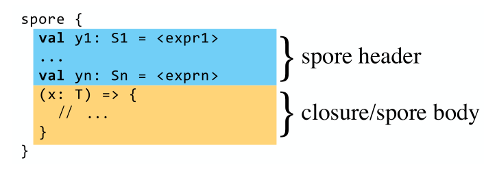

# Spores

Spores are safe, mobile closures meant for library developers and distributed systems
builders. The goal is to both control what a function is allowed to capture and
ease the process of pickling and unpickling functions and sharing them among
distributed machines.
  
More information in the official Scala
[SIP-21](http://docs.scala-lang.org/sips/pending/spores.html).

## Add spores to your project

The `spores-core` and `spores-pickling` modules for Scala 2.11 are available
on Maven Central and Sonatype. The first one contains the necessary to use
spores in any project (core type definitions and the `spore` macro), while the
second one enable spores serialization and deserialization. You can use Spores
in your sbt project by simply adding the following dependency to your build
file:

```scala
libraryDependencies += "org.scala-lang.modules" %% "spores-core" % "0.2.3"
```

To enable integration with [Scala Pickling](https://github.com/scala/pickling), add the following dependency:

```scala
libraryDependencies += "org.scala-lang.modules" %% "spores-pickling" % "0.2.3"
```

Or you can just directly download the jar files from [Maven
Central](search.maven.org).

## Define your spores!

How does a spore look like?



Spores allow software developers to have a fine-grained control of what a
function **can** or **cannot** capture from the environment. Some examples:

```scala
// A spore that doesn't capture anything from the environment
val sum: Spore[Int, Int] {type Captured = Nothing} = spore {
  (x: Int, y: Int) => x + y
}

val PI = 3.14159265359
// A spore that needs a variable from the environment
val area: Spore[Int, Int] {type Captured = Int} = spore {
  val pi = PI
  (r: Int) => pi * r * r
}

val actorAkka: Spore[Int, Unit] {type Excluded = ActorRef} = spore {
  // Any reference to ActorRef in the spores header or body will fail compilation
  val target: ActorRef = sender
  (i: Int) => target ! i
}
```
  
Do you want more examples? Have a look at the
[test suite](spores/core/src/test/scala/scala/spores).

## Building Spores

Do you want to play around with spores? Go ahead!
  
First, select the project and build it (either `spores-core` or `spores-pickling`).
> project spores-core
> buiid
  
Then, run the test suite:
> test

## Updates since the first draft (June 16th, 2013) of SIP-21

Many users expressed concern that spores would be both unusable with for-
expression syntax, and would be incompatible (without a lot of boilerplate)
with normal closures or higher-order functions which take normal functions as
arguments.

### Capture Syntax

To remedy the incompatibility with for-expressions, we propose a new `capture`
syntax. Here is an exemplary use in the context of a hypothetical
`DCollection` type:

```scala
def lookup(i: Int): DCollection[Int] = ...
val indices: DCollection[Int] = ...

for { i <- indices
      j <- lookup(i)
} yield j + capture(i)

trait DCollection[A] {
  def map[B](sp: Spore[A, B]): DCollection[B]
  def flatMap[B](sp: Spore[A, DCollection[B]): DCollection[B]
}
```


### Stable Paths

The body of spores cannot refer to an object whose fully qualified name is not a
stable path.  A **stable path** is an expression which only contains selections
and identifiers (no applications, for example), and for which each selected
entity is _stable_. In this context, _stable_ means that the entity or object in
question is introduced by object definitions or by value definitions of
non-volatile types.

Adapted from the Scala Language specification (section 3.1), a _path_ is
defined to be one of the following:

- `C.this`, where `C` references a class. The path `this` is taken as a shorthand for `C.this` where `C` is the name of the class directly enclosing the reference.
- `x` where `x` is a package.
- `p.x` where `p` is a path and `x` is a stable member of `p`. _Stable members_ are packages or members introduced by object definitions or by value definitions of non-volatile types. (Section 3.6 of the SLS.)
- `C.super.x` or `C.super[M].x` where `C` references a class and `x` references a stable member of the super class or designated parent class `M` of `C`. The prefix `super` is taken as a shorthand for `C.super` where `C` is the name of the class directly enclosing the reference.

A path refers to an object, that is, it ends with an identifier.

### Uglies

- Should objects be allowed in paths? The reason is that they are initialized lazily, so if we don't allow lazy vals, then allowing objects (which could end up being initialized only when the spore is applied) doesn't make a lot of sense.

